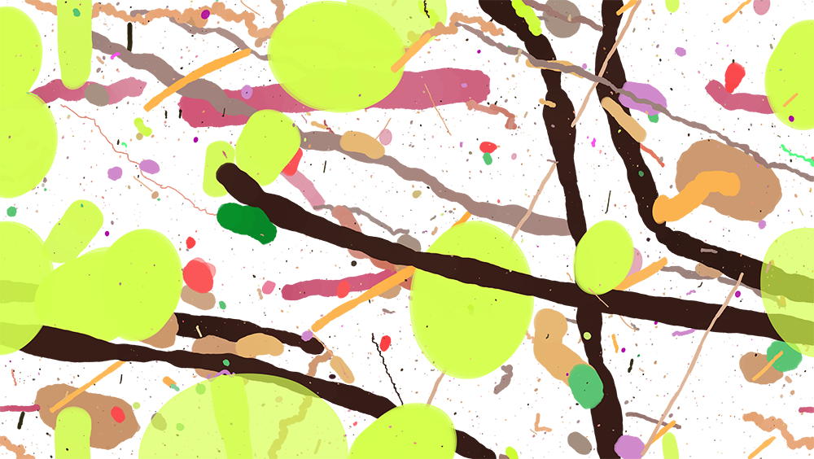

# JS_P5_sketch-nr5
A web based generative autonomous painting app. It randomly generates beautiful computer made artistic drawings in a human-like fashion.
Number 5 is named after famous painting of American artist Jackson Pollock best known with his unique abstract painting techniques. The project is ongoing effort to recreate painting process and generate countless randomized creative artworks. With build in tool menu user can narrowly customize desired brush form and dynamics or use randomized mode. The result can be saved locally as high resolution image.

### Example output

*This output was done with default settings.*

### Usage
1. Go visit the project web page listed on top of the repo.
2. Fiddle around in the right hand side for the options and see how you can co-create with your machine something beutiful.
